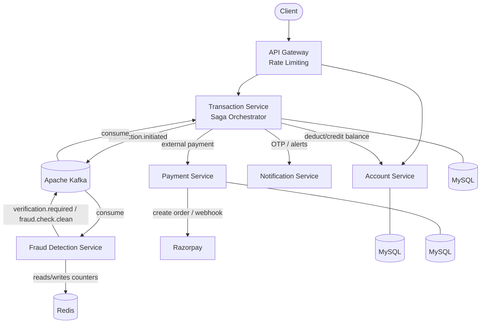
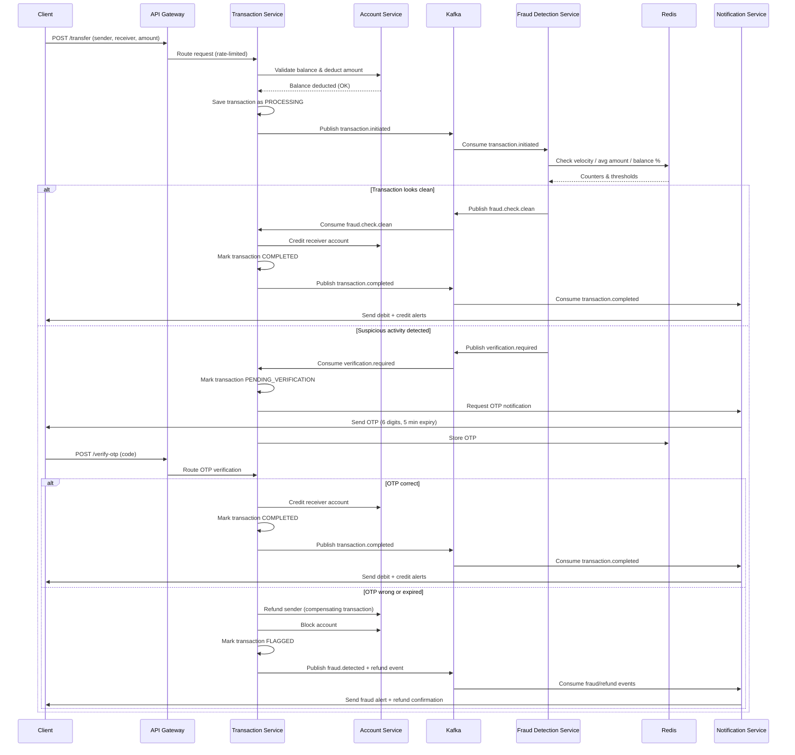

# Online Banking System

A distributed digital banking platform built with Spring Boot microservices, demonstrating real-world patterns for handling money movement safely across independent services — including the **Saga pattern** for distributed transactions, **real-time fraud detection**, and **external payment gateway integration**.

## Overview

Each core banking capability (accounts, transactions, fraud checks, payments, notifications) is implemented as an independent microservice with its own database, communicating asynchronously via **Apache Kafka**. Since a single ACID transaction can't span multiple databases, the system uses the **Saga pattern with compensating transactions** to keep data consistent even when a step in the flow fails partway through.

## Architecture



## Transaction Flow



## Services

| Service | Responsibility | Port |
|---|---|---|
| **API Gateway** | Single entry point for all requests; Redis-backed rate limiting (token bucket) | 8080 |
| **Account Service** | Account creation, balance validation, deduction/credit, blocking | 8081 |
| **Transaction Service** | Saga orchestrator — manages transaction lifecycle and compensations | 8082 |
| **Payment Service** | External payment gateway integration (Razorpay), webhook handling | 8083 |
| **Fraud Detection Service** | Real-time fraud checks using Redis-backed counters | — |
| **Notification Service** | Sends debit/credit/OTP/fraud alerts | 8085 |

## Key Features

- **Saga pattern with compensating transactions** — each service can undo its own prior step if a later step fails, avoiding the need for distributed locking across services
- **Real-time fraud detection**, using Redis to evaluate three rules on every transaction:
  - **Velocity check** — flags more than a configurable number of transactions (default: 5) within 60 seconds
  - **Amount anomaly check** — flags a transaction exceeding a configurable multiple (3–5x) of the user's average transaction amount
  - **Balance check** — flags a transaction exceeding a configurable percentage (default: 90%) of the user's available balance
- **OTP-based step-up verification** — suspicious transactions trigger a 6-digit OTP (5-minute expiry); wrong/expired OTP triggers a refund and account block
- **External payment integration** via Razorpay, including asynchronous webhook handling for payment success/failure
- **API Gateway rate limiting** to protect against abuse, using a Redis-backed token bucket
- **Event-driven architecture** via Kafka, decoupling services and enabling asynchronous, scalable communication

## Transaction Lifecycle

| Status | Meaning |
|---|---|
| `PENDING` | Transaction initiated, not yet processed |
| `PROCESSING` | Balance deducted, fraud checks in progress |
| `PENDING_VERIFICATION` | Suspicious activity detected; awaiting OTP |
| `COMPLETED` | Successfully processed, receiver credited |
| `FAILED` | Failed validation or a system error |
| `FLAGGED` | Fraud confirmed; account blocked, transaction refunded |

## Tech Stack

- **Language / Framework:** Java, Spring Boot, Spring Cloud Gateway, Spring Kafka, Spring Data Redis
- **Database:** MySQL (separate schema per service)
- **Cache / Transient State:** Redis (OTPs, fraud counters, rate limiting)
- **Messaging:** Apache Kafka + Zookeeper
- **Payments:** Razorpay
- **Containerization:** Docker, Docker Compose
- **Build Tool:** Maven

## Getting Started

### Prerequisites

- Java 17+
- Maven
- Docker & Docker Compose

### Run the infrastructure

```bash
docker compose up -d
```

This starts MySQL, Redis, Zookeeper, and Kafka.

### Run each service

From each service's directory:

```bash
mvn spring-boot:run
```

Start them in this order: Account Service → Transaction Service → Fraud Detection Service → Notification Service → Payment Service → API Gateway.

### Example: initiate a transfer

```bash
curl -X POST http://localhost:8080/api/transactions/transfer \
  -H "Content-Type: application/json" \
  -d '{
    "senderAccountNumber": "123456789012",
    "receiverAccountNumber": "987654321098",
    "amount": 5000
  }'
```

## Project Structure

```
├── api-gateway/
├── account-service/
├── transaction-service/
├── fraud-detection-service/
├── payment-service/
├── notification-service/
└── docker-compose.yml
```

## Roadmap

- [ ] API documentation via Swagger/OpenAPI
- [ ] JWT-based authentication and authorization
- [ ] Idempotency keys for the transfer API
- [ ] Circuit breaker (Resilience4j) around Payment Service calls to Razorpay
- [ ] Distributed tracing (Spring Cloud Sleuth + Zipkin)
- [ ] Integration tests with Testcontainers
- [ ] CI pipeline (GitHub Actions)

## License

This project is for educational and portfolio purposes.
